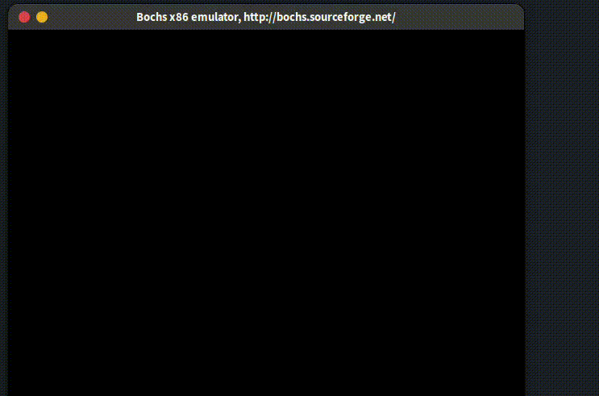

[中文](./README-cn.md)
# XUN-OS: Build Your Own Operating System
> Learning by doing
## Overview
For beginners in operating system development, particularly those intrigued by Linux, creating a mini Unix-like OS is an enlightening journey. XUN-OS, designed with simplicity in mind, is a compact OS that serves as an excellent reference for such endeavors. It's a practical approach for understanding OS principles, offering a glimpse into Linux-like implementations. The project, detailed in a Linux kernel style documentation, minimizes confusion and enhances comprehension. It's not just about learning theories but actually building and experimenting, which XUN-OS facilitates perfectly for anyone starting in the fascinating world of OS development.



## Features
- **Process/Thread Management**: Creation, switching, and scheduling of processes and threads.
- **Segmentation and Paging in Virtual Memory**: Implements segmented paging for virtual memory management.
- **Process Heap Memory Management**: Manages heap memory for processes.
- **I/O System**: Includes drivers for hard disks and keyboards.
- **File System**: Basic file system functionalities.
- **System Interaction**: Simple shell supporting basic commands, fork system calls, and user process loaders.
- **Lock Mechanisms**: Synchronization for multi-threading and multi-processing.

## Getting Started

### Clone the Repository
```zsh
git clone git@github.com:Elite-zx/XUN-OS.git
cd XUN-OS
```

### Compile and Run
Compile the OS with:
```zsh
./run.sh
make all
```

Write the compiled kernel to a disk image:
```zsh
dd if=build/kernel.bin of=/path/to/bochs/hd60M.img bs=512 count=200 seek=9 conv=notrunc
```

### Launching XUN-OS
Run the OS using Bochs:
```zsh
bochs -f bochsrc.disk
```
Ensure Bochs is installed and `bochsrc.disk` is properly configured.

## Contributing
Contributions are welcome! Feel free to submit PRs or open issues for suggestions or bug reports.
